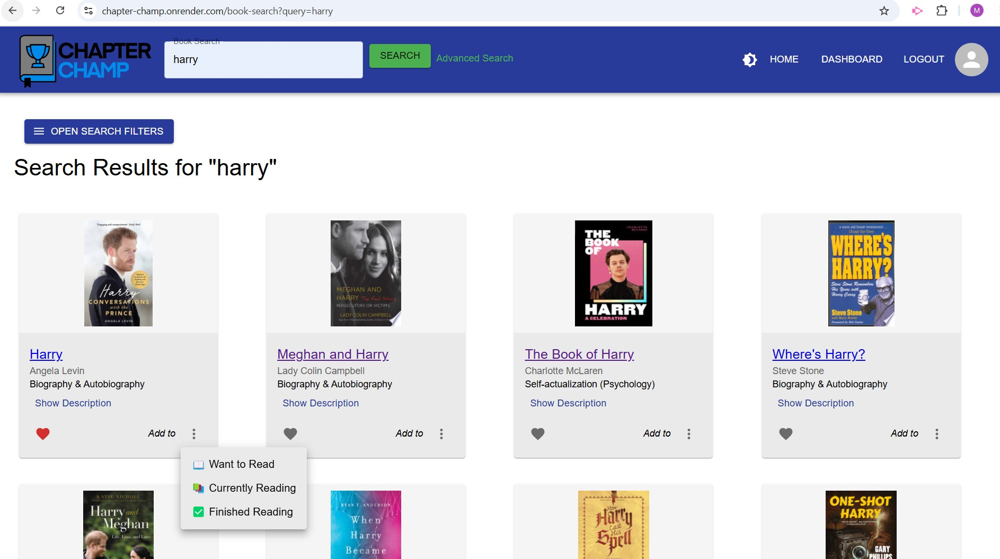
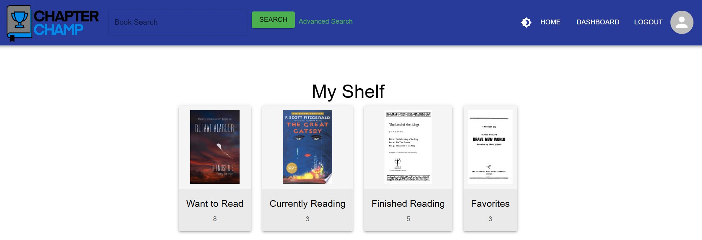
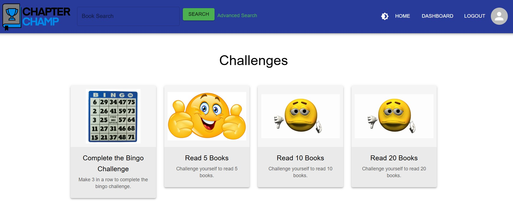

# Chapter Champ

## Description

Are you tired of seeing half-finished books on your shelf? Tired of forgetting the book recommendations your friends gave you? Tired of setting New Year's resolutions to read more, only to find yourself falling behind by February? Despair no more. Chapter Champ is your all-in-one digital library that keeps track of your reading goals, favorite books, and all of your progress right in one place. With an intuitive search tool and gamified challenges, staying on top of your reading has never been easier—or more fun!Simply curate your reading list and start accomplishing your reading goals one challenge at a time.

## Table of Contents

   - [Installation](#installation)
   - [Technologies](#Technologies)
   - [Usage](#usage)
   - [Screenshots](#screenshots)
   - [Challenges](#challenges)
   - [Future Implementation](#Future-Implementation)
   - [Contributing](#Contributing)
   - [Credits](#Credits)
   - [License](#license)

## Installation

After downloading the code,ensure your .env file points to the Mongo DB either local or in Atlas. Do an npm i, npm run build and then npm run start:dev to launch the application.

## Technologies

This project was created using React, TypeScript, Material UI, CSS, Lucide, Node.js, Express.js, Apollo GraphQL, MongoDB, Mongoose, JWT, Apollo Client, Github, Render and bcrypt.

## Usage

Head over to our [Chapter Champ website](https://chapter-champ.onrender.com)! Then, simply click the LOGIN/SIGNUP button to create a new account or login to your existing account. 

Next, use the search bar to find a book that you want to add to your shelf. A user's shelf has four categories: Want to Read, Currently Reading, Finished Reading, and Favorites. Once you find your book, click its heart icon to add it to your Favorites. Otherwise, the three-dots present a drop-down menu, allowing a user to add the book to the Want to Read, Currently Reading, or Finished Reading sections of their shelf.

Click the Challenges option under Dashboard to explore the various challenges to suit readers of different levels. If you are a beginner start with the Bingo Challenge and then explore other advanced challenges like Read 5 or 10 or 20 Books!

## Screenshots

**Search Books**

    
**My Book Shelf**
 

        
**Challenges**

      
## Challenges

Some of the challenges we faced during the project was ensuring we build our application that is responsive and intuitive UI/UX across both desktop and mobile platforms. Besides that we had to learn Material UI at a faster pace.

## Future Implementation

Introduce more gamification features: badges, rewards, track number of pages read.
Social features: add friends, comments, book recommendations.
Ability to sort and filter my books by genre, author.
Ability to promote the user to Admin and assist with reset password.

## Contributing

You could provide further ideas to enhance the website, help report bugs , assist with development efforts as well.

## Credits

Chapter Champ is brought to you by [Mahesh-GH24](https://github.com/Mahesh-GH24), [mikelind28](https://github.com/mikelind28), [Sinnema1](https://github.com/Sinnema1), and [xfigueroa](https://github.com/xfigueroa).

## License

This repository uses an [MIT License ↗️](./LICENSE.txt).
